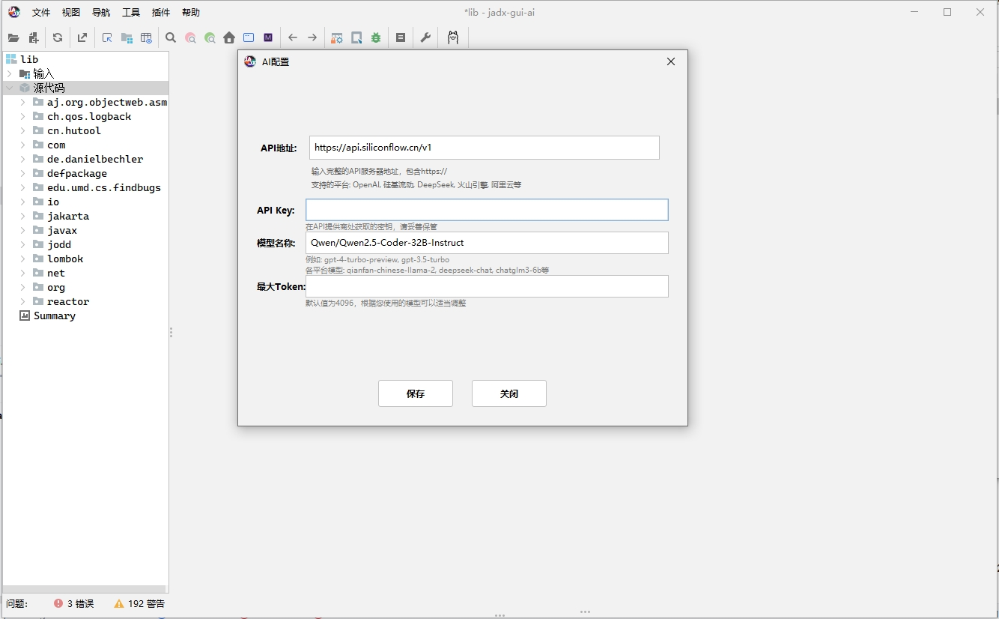

## JADX-GUI-AI
**jadx-gui-ai** - 基于 JADX 的智能反编译工具（持续更新中......）

这是一个在 JADX 基础上增强的智能反编译工具,集成了 AI 辅助功能,可以帮助开发者更好地理解和分析反编译后的代码。

**主要功能：**
- 继承 JADX 的所有核心功能:
  - 将 APK、dex、aar、aab 和 zip 文件中的 Dalvik 字节码反编译为 Java 代码
  - 从 `resources.arsc` 解码 `AndroidManifest.xml` 和其他资源
  - 内置反混淆工具
- AI 增强功能:
  - 智能代码分析与解释
  - 代码逻辑推理
  - 变量和函数命名优化建议
  - 代码结构重构建议
  - 安全漏洞检测

### 功能演示

#### AI的API KEY 设置页面

#### AI 智能搜索界面

#### 智能代码菜单

#### AI代码注释/翻译
##### 翻译中

##### 翻译结果

#### AI代码安全审计

**jadx-gui-ai 特性：**
- JADX-GUI 原有功能:
  - 使用语法高亮查看反编译的代码
  - 跳转到声明
  - 查找使用
  - 全文搜索
  - smali 调试器
- AI 辅助界面:
  - 智能代码分析面板
  - 交互式代码解释
  - 一键优化建议

> [!提示]
> 本项目是 JADX 的增强版本,添加了 AI 辅助功能来提升反编译代码的可理解性和可用性。

### 安装说明

1. 确保系统已安装 Java 11 或更高版本
2. 下载最新发布版本
3. 解压后运行 `bin` 目录下的:
   - `jadx-gui-ai` - 图形界面版本(推荐)
   - `jadx` - 命令行版本

**Windows 用户注意:**
- 双击运行 `.bat` 文件
- 需要 64 位的 Java 11+
- 可以从 [oracle.com](https://www.oracle.com/java/technologies/downloads/#jdk17-windows) 下载 JDK (选择 x64 安装包)

### 使用方法

1. 启动 jadx-gui-ai
2. 打开需要分析的文件 (.apk, .dex, .jar 等)
3. 使用右侧 AI 助手面板获取智能分析和建议
4. 可以通过交互式对话获取更详细的代码解释

### 贡献

欢迎为项目提供建议和改进:
- 提交新功能建议
- 报告问题
- 提交代码改进

### 致谢

本项目基于 [JADX](https://github.com/skylot/jadx),感谢原作者的杰出工作。

---------------------------------------
*基于 Apache 2.0 许可证*
