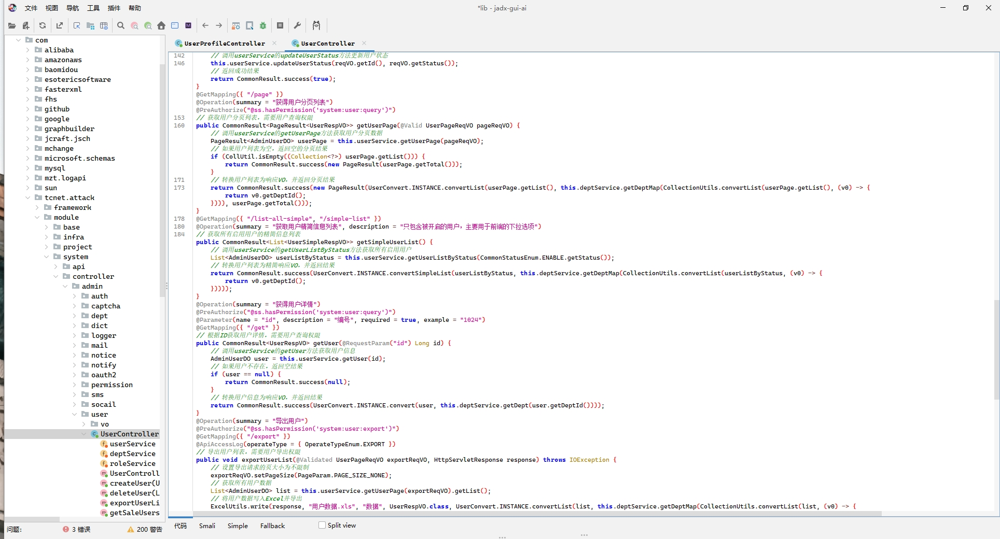

# JADX-GUI-AI

  
  
基于 JADX 的智能反编译工具

  
云麾安全实验室

  

    
    
    
  

## 📝 项目简介

JADX-GUI-AI 是一个在 JADX 基础上增强的智能反编译工具，集成了 AI 辅助功能，可以帮助开发者更好地理解和分析反编译后的代码。本工具特别适合以下场景：

- Android 应用逆向分析
- 恶意代码检测
- 代码审计
- 漏洞挖掘
- 安全研究

## ✨ 主要功能

### JADX 核心功能
- 将 APK、dex、aar、aab 和 zip 文件中的 Dalvik 字节码反编译为 Java 代码
- 从 `resources.arsc` 解码 `AndroidManifest.xml` 和其他资源
- 内置反混淆工具
- 支持多种文件格式：
  - APK 文件
  - DEX 文件
  - AAR 文件
  - AAB 文件
  - ZIP 文件
  - JAR 文件

### AI 增强功能
- 智能代码分析与解释
  - 自动分析代码逻辑结构
  - 提供代码执行流程说明
  - 识别关键业务逻辑
- 代码逻辑推理
  - 智能推测代码意图
  - 分析代码依赖关系
  - 提供代码优化建议
- 变量和函数命名优化建议
  - 基于上下文的智能命名
  - 符合编程规范的命名建议
- 代码结构重构建议
  - 识别代码坏味道
  - 提供重构方案
  - 优化代码结构
- 安全漏洞检测
  - 常见漏洞模式识别
  - 安全最佳实践建议
  - 漏洞修复方案

## 🎯 功能演示

### AI 设置

> 配置 AI 模型参数和 API 密钥，支持多种 AI 模型选择。

### AI 智能搜索

#### 搜索结果界面

> 智能语义搜索，快速定位目标代码

### 智能代码菜单

> 右键菜单集成 AI 功能，便捷操作

### AI 代码注释/翻译
#### 翻译过程

> 实时翻译代码注释，支持多语言

#### 翻译结果

> 智能生成高质量代码注释

### AI 代码安全审计

> 自动检测潜在安全漏洞

## 🔧 详细特性

### JADX-GUI 基础功能
- 使用语法高亮查看反编译的代码
  - 支持多种编程语言
  - 自定义主题
  - 代码折叠
- 跳转到声明
  - 快速导航
  - 引用追踪
- 查找使用
  - 全局搜索
  - 正则匹配
- 全文搜索
  - 支持模糊匹配
  - 结果高亮
- smali 调试器
  - 断点调试
  - 变量监视
  - 单步执行

### AI 辅助界面
- 智能代码分析面板
  - 代码结构树
  - 依赖关系图
  - 调用链分析
- 交互式代码解释
  - 实时问答
  - 上下文感知
  - 多轮对话
- 一键优化建议
  - 性能优化
  - 代码质量
  - 安全加固

> [!提示]
> 本项目是 JADX 的增强版本，添加了 AI 辅助功能来提升反编译代码的可理解性和可用性。

## 📥 安装说明

### 系统要求
- Java 11 或更高版本
- 最小内存：4GB
- 推荐内存：8GB
- 操作系统：
  - Windows 10/11
  - macOS 10.15+
  - Linux (Ubuntu 20.04+)

### 安装步骤
1. 确保系统已安装 Java 11 或更高版本
2. 下载最新发布版本
3. 解压后运行 `bin` 目录下的:
   - `jadx-gui-ai` - 图形界面版本(推荐)
   - `jadx` - 命令行版本

### Windows 用户特别说明
- 双击运行 `.bat` 文件
- 需要 64 位的 Java 11+
- 可以从 [oracle.com](https://www.oracle.com/java/technologies/downloads/#jdk17-windows) 下载 JDK (选择 x64 安装包)
- 如果遇到权限问题，请以管理员身份运行

## 🚀 使用方法

### 快速开始
1. 启动 jadx-gui-ai
2. 打开需要分析的文件 (.apk, .dex, .jar 等)
3. 使用右侧 AI 助手面板获取智能分析和建议
4. 可以通过交互式对话获取更详细的代码解释

### 高级功能
- 自定义 AI 模型配置
- 批量分析支持
- 导出分析报告
- 自定义规则配置

## 🤝 贡献指南

### 如何贡献
欢迎为项目提供建议和改进:
- 提交新功能建议
- 报告问题
- 提交代码改进
- 完善文档

### 开发环境设置
1. Fork 项目
2. 克隆到本地
3. 安装依赖
4. 运行测试
5. 提交 PR

## 🙏 致谢

### 开源项目
本项目基于以下开源项目：
- [JADX](https://github.com/skylot/jadx) - 核心反编译引擎
- [OpenAI API](https://openai.com/api/) - AI 能力支持
- [其他依赖项目](docs/dependencies.md)

### 贡献者
感谢所有为项目做出贡献的开发者！

---

  
基于 Apache 2.0 许可证

  
Copyright © 2024 云麾安全实验室

